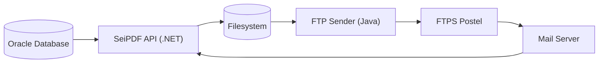
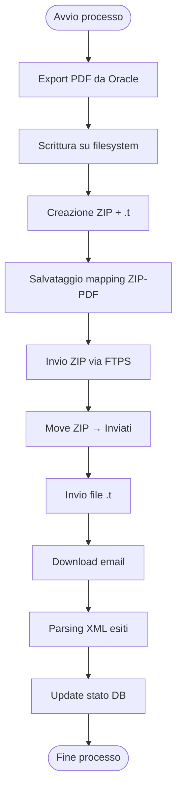

# SeiPDF Management


Sistema per la gestione automatizzata del ciclo documentale SEIPDF.

---

## 📌 Descrizione

**SeiPDF Management** è un sistema distribuito che gestisce il ciclo completo di trasmissione documentale verso piattaforma Postel, automatizzando:

- estrazione documenti PDF da database Oracle
- gestione file su filesystem locale
- creazione archivi ZIP conformi ai vincoli di invio
- trasmissione tramite FTPS
- gestione esiti tramite email
- aggiornamento stati su database
- logging e tracciamento completo delle operazioni

Il sistema è progettato per operare in modalità **batch schedulata**, senza intervento manuale.

---

## 🏗️ Architettura

Il sistema è composto dai seguenti componenti:

- **API SeiPDF (.NET 8 – ASP.NET Core su IIS)**
- **Servizio FTP (Java 21 – Tomcat)**
- **Database Oracle**
- **File System locale (DaInviare / Inviati)**
- **Server FTPS Postel**
- **Sistema Mail (Microsoft 365)**

---

### 📊 Schema logico



## 🔄 Flusso operativo

	1. Estrazione PDF da database Oracle
	2. Scrittura su filesystem (DaInviare)
	3. reazione ZIP e file .t
	4. Invio ZIP tramite FTPS
	5. Invio file .t (solo dopo ZIP)
	6. Ricezione esiti via email
	7. Aggiornamento stati su database

## 📊 Diagramma di flusso



## ⚙️ Configurazione

La configurazione del sistema è gestita tramite file esterni, separati per componente:

- `appsettings.json` → configurazione API .NET
- `application.properties` → configurazione servizio FTP Java

### Parametri principali

- Connessione database Oracle
- Directory filesystem (`DaInviare`, `Inviati`)
- Configurazione FTPS (host, porta, credenziali)
- Configurazione mail (IMAP + OAuth2)
- Parametri creazione ZIP:
  - dimensione massima
  - numero massimo file
- Configurazione logging

---

## 🔐 Sicurezza

Il sistema adotta le seguenti misure:

- Trasferimento file tramite FTPS (TLS)
- Accesso API limitato a rete interna
- Swagger protetto con Windows Authentication
- Autenticazione OAuth2 per accesso email
- Gestione sicura credenziali (no hardcoding)
- Logging senza dati sensibili
- Permessi filesystem basati su principio del minimo privilegio

---

## 📊 Stati dei lotti

```bash
PDF_GENERATO → ZIPPATO → INVIATO → RICEVUTO → ACCETTATO → ELABORATO
```

Gli errori vengono gestiti tramite comunicazioni esterne (non tramite stati applicativi).


Eventuali anomalie non vengono gestite tramite stati applicativi, ma tramite comunicazioni esterne.

---

## 📊 Logging

Il sistema prevede diversi livelli di logging:

- **Applicativo (.NET e Java)**
- **Scheduler (PowerShell / batch)**
- **Database (stati e tracciamento)**

### Caratteristiche

- log giornalieri
- tracciamento completo delle operazioni
- supporto al troubleshooting
- separazione tra log tecnici e log applicativi

---

## 📦 SBOM (Software Bill of Materials)

Il sistema supporta la generazione di SBOM tramite **Syft**.

### Generazione SBOM

```bash
syft . -o cyclonedx-json > sbom.json
```

### Analisi vulnerabilità

```bash
grype sbom:sbom.json
```
---

## 🚀 Deploy

### Requisiti

- Windows Server 2022
- .NET 8 Runtime
- Java 21
- Tomcat 9
- IIS
- Oracle Database

---

### 
Esecuzione 

- API .NET deployata su IIS
- servizio FTP deployato su Tomcat
- job eseguiti tramite Windows Task Scheduler

---

## ⏱️ Scheduling

Il sistema SeiPDF Management opera tramite esecuzione batch schedulata utilizzando **Windows Task Scheduler**.

I processi sono indipendenti ma concatenati logicamente lungo il flusso documentale.

---

### 📊 Pianificazione processi

| Processo        | Endpoint / Servizio            | Frequenza       | Descrizione |
|----------------|------------------------------|-----------------|-------------|
| Export PDF     | `/api/seipdf/export-pdf`     | ogni 5 minuti   | Estrazione PDF da Oracle e scrittura su filesystem |
| Create ZIP     | `/api/seipdf/create-zip`     | ogni 30 minuti  | Creazione archivi ZIP e file `.t` |
| Invio FTP      | `/inviaFtp` (Java Tomcat)    | ogni 30 minuti  | Invio file ZIP e `.t` verso Postel |
| Gestione Mail  | `/api/Mail/download-unread`  | ogni 60 minuti  | Lettura email e aggiornamento stati |

---

### 🔄 Sequenza logica

```text id="sched-flow"
Export PDF → Create ZIP → Invio FTP → Gestione Mail
```
---

### ⚙️ Modalità di esecuzione

- esecuzione automatica tramite Task Scheduler
- invocazione API tramite script PowerShell
- invio FTP tramite script .bat
- riesecuzione automatica in caso di errore

---

## 🛠️ Tecnologie

- .NET 8 (ASP.NET Core)
- Java 21
- Oracle Database
- FTPS (TLS)
- IIS
- Tomcat
- MailKit (IMAP)
- Serilog